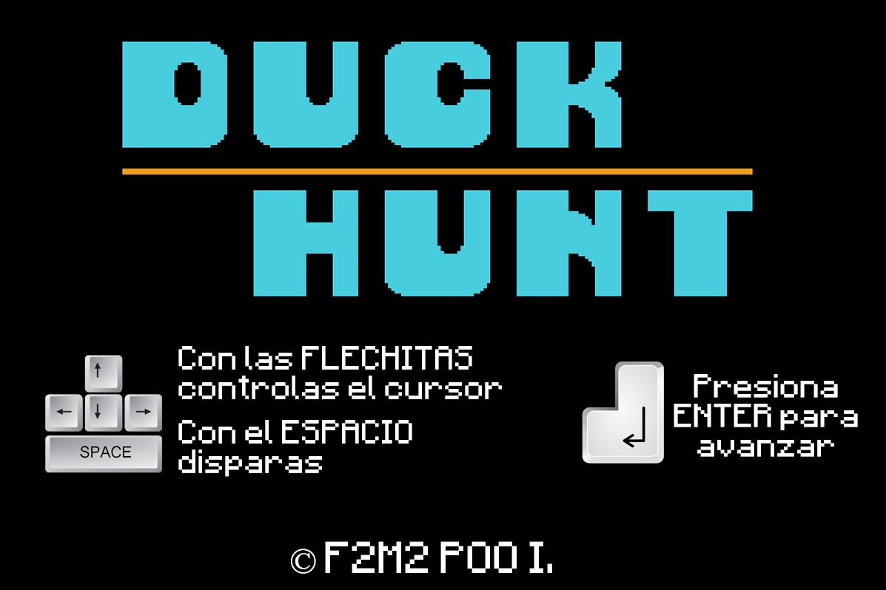
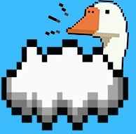
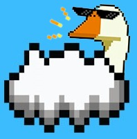

# DUCK HUNT

## Equipo de desarrollo

- Andres Martinez
- Martin Bercaitz
- Federico Jose Breme

## Captura 

## Reglas de Juego 

Nuestro juego es una breve imitacion del celebre juego **Duck Hunt** de **Nintendo** 
En esta edicion, los patos se generan detras de las nubes que se pueden presenciar dentro del tablero, y nuestro objetivo es, utilizando las flechas del teclado, mover la mira y dispararle a los patos

* Por cada pato disparado se le asignara 10 puntos al jugador
* El jugador comenzara con *5 balas*, las cuales a medida que vaya disparando iran bajando
* en el caso de que se equivoque y no le de al pato al disparar *se le restara una bala*, lo mismo pasara si le dispara al pato

El juego finalizara cuando el jugador **ya no tenga balas** 

## Pato dorado

A diferencia del juego original, hemos sumado una variante de pato llamado **Pato Dorado**, el cual es un pato de color dorado y gafas de sol

* Al matarlo, otorga *20 puntos mas* que cuando matas un pato comun (osea, 30 puntos en total)
* Al morir, el pato dorado te otorgara *2 balas extra* para seguir jugando

## Instrucciones

* **Mover la mira:** Flechas de direccion (arriba, abajo, izquierda, derecha)
* **Disparar:** Tecla espaciadora (espacio)
* **Comenzar el juego:** Enter
* **Reiniciar juego:** Tecla R 

**DISFRUTEN DEL JUEGO**

## Creditos

- Universidad Nacional de Hurlingham
- Programacion de Objetos I
- Profesor/es: Lucas Spigariol, Hernan Coniglio
- Comision 2
- Versión de wollok:  

